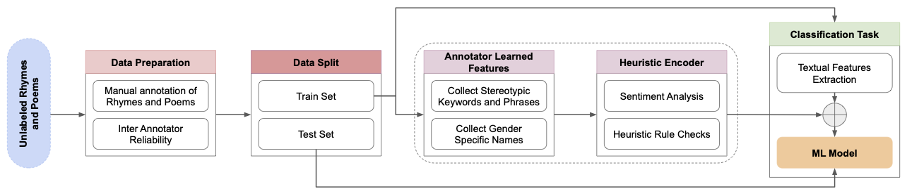
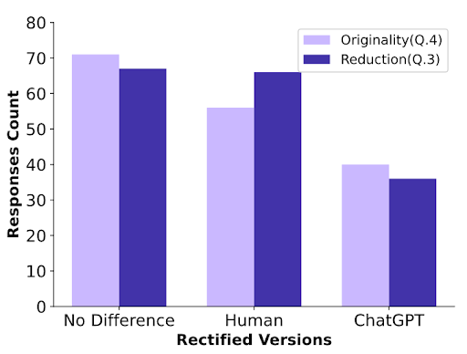

# Revisiting The Classics: A Study on Identifying and Rectifying Gender Stereotypes in Rhymes and Poems

Our research paper titled "Revisiting The Classics: A Study on Identifying and Rectifying Gender Stereotypes in Rhymes and Poems" delves into a thorough examination of gender biases within classical literature, specifically focusing on rhymes and poems. The primary objective of the study is to identify and address these identified stereotypes using a Large Language Model (LLM).

## Datset Curation

We analyzed poems and rhymes aimed at children and adolescents to see how often they contain gender stereotypes. For this task, a diverse collection of children's rhymes and poetry suitable for adolescents were curated from various sources, including works by renowned poets like [Shakespeare](https://nosweatshakespeare.com/sonnets/), [Frost](https://www.robertfrost.org/poems.jsp), etc, as well as popular compilations such as [Mother Goose](https://allpoetry.com/Mother-Goose). This dataset was thoughtfully selected to encompass a range of styles, themes, and cultural backgrounds, with valuable insights from experts in Literature and Education. Employing a two-phase annotation approach, annotators established clear annotation guidelines and labelled the dataset. Additionally, the inclusion of translated poems from multiple languages enriched the dataset, making it a comprehensive resource for analysis and further research.

### Dataset Statistics

| **Label**                	| \# Verses 	| \# Lines 	|
|--------------------------	|-----------	|----------	|
| Stereotypical Rhymes     	|        65 	|      151 	|
| Non-Stereotypical Rhymes 	|       274 	|    5,157 	|
| Stereotypical Poems      	|        80 	|      359 	|
| Non-Stereotypical Poems  	|       242 	|    7,647 	|
| *Augmented Stereotypes* (Rhymes+ Poems)|290|    1,347 |
| Total                    	|       661 	|   13,314 	|
| *Total with Augmentation* |       951     |    14,661 |


### Distribution of publicly available poems/rhymes translated from other languages

|Language|# Poems|
|-----------|---|
|English    |641|
|Italian    |3  |
|Portugese  |3  |
|Spanish    |3  |
|French     |2  |
|German     |2  |
|Mandarin   |2  |
|Hindi      |1  |
|Japanese   |1  |
|Korean     |1  |
|Malay      |1  |
|Russian    |1  |

## Heuristic Encoder

Another contribution is model performance improvement enhanced through the integration of a Heuristic Encoder. 

Generally, a model for classification uses only the ground truth for optimizing the predictions. However, studies have shown that knowledge-infused models perform better for specific tasks (Logan et al., 2019).

Inspired by this finding, we propose the concept of a Heuristic Encoder, which instead of using an external knowledge base, used  annotator-learned features to complement the input features to enhance the model’s prediction ability. 

To achieve this, the annotators were asked to compile a comprehensive list of words, phrases and gender-specific names that they consider stereotypical from the list of poems and rhymes that were annotated, making the feature list limited to the dataset for better contextual understanding, acting as an additional source other than the text features. In addition, we also perform sentiment analysis as part of the encoding process, enabling the identification and characterization of sentiment patterns and tendencies within the text, contributing to a deeper understanding of the emotional aspects conveyed.

<!-- 

<p>
    
</p>

A binary valued feature vector is generated for the given text, using the annotator learned features collected during the encoder design process as part of the annotation process. The structure of each vector is defined as follows: [Male Names, Female Names, Stereotypes, Negative, Positive]. This vector is designed to encompass relevant information related to gender-specific names, identified stereo- types, and sentiment polarity.

Heuristic Encoder lead to improvements in key metrics such as precision, recall, and F1-Score for feature-based models. 

## Stereotype Classification

Our best performing model with a remarkable 97% accuracy in identifying gender stereotypes in rhymes and poems, is BERT<sub>SS</sub>(1L). Another contribution is model performance improvement enhanced through the integration of a Heuristic Encoder, leading to improvements in key metrics such as precision, recall, and F1-Score for feature-based models. 

| **Model Name (nL/F)** 	| **Accuracy** 	| **Precision** 	| **Recall** 	| **F1-Score** 	|
|-----------------------	|:------------:	|:-------------:	|:----------:	|:------------:	|
| XGBoost (F)           	|     0.72     	|      0.62     	|    0.66    	|     0.63     	|
| XGBoost + HE (F)      	|     0.77     	|      0.66     	|    0.66    	|     0.66     	|
| XGBoost (2L)          	|     0.93     	|      0.73     	|    0.71    	|     0.72     	|
| XGBoost + HE (2L)     	|     0.94     	|      0.74     	|    0.73    	|     0.74     	|
| BERT Base (F)         	|     0.83     	|      0.75     	|     0.8    	|     0.77     	|
| BERT Base (2L)        	|     0.94     	|      0.76     	|    0.79    	|     0.77     	|
| BERT<sub>SS</sub> (F)   	|     0.82     	|      0.74     	|    0.69    	|     0.71     	|
| **BERT<sub>SS</sub> (1L)**|   **0.97**   	|    **0.77**   	|  **0.81**  	|   **0.79**   	|

## Rectification

The identified rhymes were rectified using an LLM, which was then compared using an educator’s rectified version and presented as a survey to participants. The result was that there was no significant difference between a human and LLM.

<!-- [Plot of the Responses]("./img/Responses.png") -->

<p align="center">
    
</p>

Furthermore, our study underscored the importance of considering the social and intellectual context in which classical literature was crafted, emphasizing the need for a critical approach when engaging with these works and using LLMs to help provide content to understand society in an unbiased way.

---

Our study's outcomes emphasize the prevalence of gender stereotypes in classical literature and stress the significance of rectifying these biases to foster inclusivity and gender equality. By reimagining and rewriting traditional rhymes and poems, authors can play a pivotal role in correcting these biases and presenting a more inclusive depiction of history that embraces diverse perspectives, especially those of women and marginalized groups.

---

## Citation

If you use our dataset or findings, please cite us using:
```
@misc{sankaran2024revisiting,
      title={Revisiting The Classics: A Study on Identifying and Rectifying Gender Stereotypes in Rhymes and Poems}, 
      author={Aditya Narayan Sankaran and Vigneshwaran Shankaran and Sampath Lonka and Rajesh Sharma},
      year={2024},
      eprint={2403.11752},
      archivePrefix={arXiv},
      primaryClass={cs.CL}
}
```